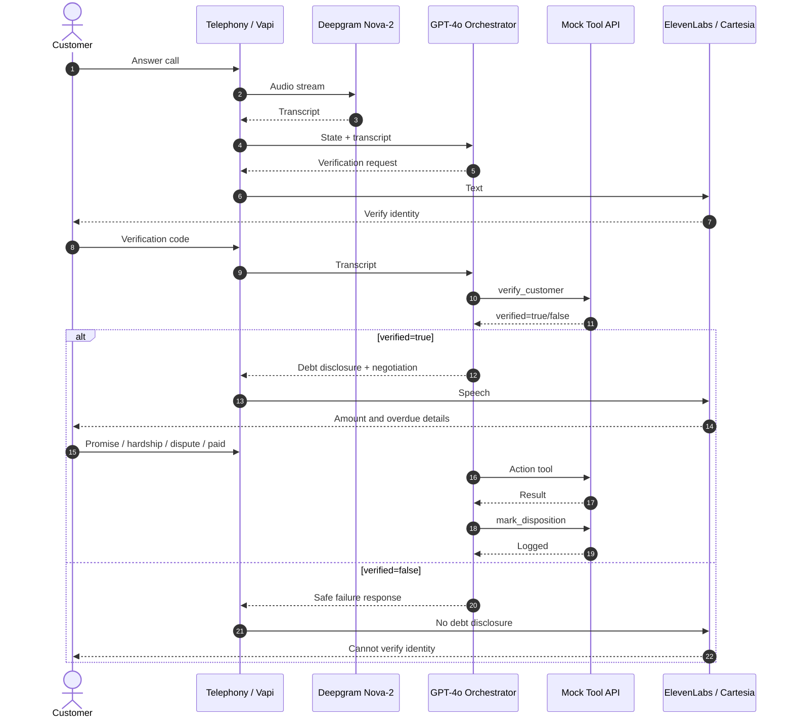

# Kapture Finance — Maya Voice AI Collections Agent
## High-Level Design Document

## 1. Objective

Maya is an outbound Voice AI Collections Agent for Kapture Finance. The system authenticates the intended customer before any debt information is disclosed, identifies the customer's intent, executes an appropriate resolution action, and records a final disposition.

The source assignment requires an engineer-ready HLD covering architecture, state machine, compliance, API tools, edge cases, latency and observability. 

## 2. System Architecture



### Components

| Component | Responsibility |
|---|---|
| Telephony/Vapi | Call control, audio streaming, orchestration, tool dispatch |
| Deepgram Nova-2 | Low-latency speech-to-text |
| GPT-4o | Conversation reasoning and intent/entity extraction |
| Custom Tool API | Deterministic business actions |
| ElevenLabs/Cartesia | Text-to-speech |
| Mock data layer | Demo customer/account and disposition behavior |

## 3. Latency Budget

Target end-to-end conversational turn latency is below 1.2 seconds as specified by the assignment.

| Hop | Target |
|---|---:|
| STT | ~200 ms |
| LLM first byte | ~400 ms |
| TTS synthesis | ~300 ms |
| Network/overhead | ~200 ms |
| **Total** | **~1.1 s** |

The budget is a target, not a guarantee. Tool calls should be fast and deterministic; production integrations should use regional deployment, connection reuse, bounded timeouts and idempotency.

## 4. Conversation State Machine

Required states:

```text
INIT
  ↓
AUTH_PENDING
  ├── verify_customer=false → CALL_ENDED
  └── verify_customer=true  → AUTHENTICATED
                                  ↓
                              NEGOTIATION
                    ┌─────────────┼─────────────┐
                    ↓             ↓             ↓
              PTP_COLLECTED   ESCALATED    CALL_ENDED
                    ↓             ↓
               CALL_ENDED     CALL_ENDED
```

### Hard invariant

`AUTH_PENDING -> AUTHENTICATED` is permitted **only** after a server tool response explicitly returns `verified: true`.

The LLM must never infer successful authentication from conversational confidence alone. It must wait for the tool response. This is the central security requirement in the assignment.

## 5. Intent and Entity Model

| Intent | Required action |
|---|---|
| `Confirm_Identity` | Continue authentication |
| `Promise_To_Pay` | Capture date/amount, log PTP, optionally send payment link |
| `Hardship_Claim` | Capture reason and escalate |
| `Dispute_Debt` | Escalate to resolution desk |
| `Already_Paid` | Capture payment details and mark disposition |
| `Request_DNC` | Immediately log DNC and end call |
| `Wrong_Person` | Mark wrong person and end/ask availability |

| Entity | Type |
|---|---|
| `PTP_Date` | ISO-8601 date |
| `PTP_Amount` | Number |
| `Hardship_Reason` | String |
| `Verification_Code` | String |

## 6. Tool/API Design

### `verify_customer`

Input:

```json
{
  "account_id": "ACC-88392",
  "verification_code": "1234"
}
```

Output:

```json
{
  "verified": true,
  "message": "Identity verified successfully."
}
```

### `log_promise_to_pay`

```json
{
  "account_id": "ACC-88392",
  "ptp_date": "2026-08-14",
  "amount": 8499
}
```

### `send_payment_link`

```json
{
  "account_id": "ACC-88392",
  "channel": "SMS"
}
```

### `escalate_to_agent`

```json
{
  "account_id": "ACC-88392",
  "reason": "DISPUTE",
  "notes": "Customer disputes the outstanding amount."
}
```

### `mark_disposition`

```json
{
  "account_id": "ACC-88392",
  "status": "PTP_AGREED",
  "notes": "Customer committed to pay on 2026-08-14."
}
```

Vapi's current custom-tool contract uses a `tool-calls` request and expects a response containing `results` with the matching `toolCallId` and a serialized result. 

## 7. Authentication and Data Safety

### Pre-auth rules

Before successful verification, Maya must not disclose:

- overdue status
- loan/EMI information
- outstanding amount
- days past due
- debt relationship with Kapture Finance


### Logging

Use masked customer identifiers where possible, e.g. `Rahul S****`. Do not log full verification codes or unnecessary PII.

### Tool trust boundary

The model proposes tool parameters; the server validates the operation. A production server must independently enforce authorization and state, rather than trusting the LLM prompt.

## 8. Compliance and Guardrails


Additional guardrails in the implementation:

1. Never fabricate verification success.
2. Never invent payment confirmation.
3. Never promise a waiver or concession outside configured policy.
4. Never argue or threaten.
5. DNC request terminates the conversation after logging.
6. Disputes route to a human/resolution process.
7. Tool failure produces a safe fallback rather than fabricated success.
8. Repeated invalid verification ends the call without debt disclosure.

## 9. Edge Case Matrix

| Case | Behavior | Disposition |
|---|---|---|
| Wrong person | Do not disclose debt; end/ask availability | `WRONG_PERSON` |
| Verification failure | Retry within limit, then terminate | `NO_RESPONSE` |
| Already paid | Capture date/mode/reference | `ALREADY_PAID` |
| Hardship | Empathy + escalation | `HARDSHIP_ESCALATED` |
| Dispute | Resolution escalation | `DISPUTED` |
| DNC | Log immediately and end | `DO_NOT_CALL` |
| Abuse | One warning, then soft hangup | `NO_RESPONSE` |
| Silence/voicemail | Two re-prompts then hangup | `NO_RESPONSE` |
| Hindi/Hinglish | Continue while preserving state | Existing disposition |


## 10. Observability

Primary metrics:

- **Containment Rate:** resolved without human escalation
- **PTP Rate:** valid PTP outcomes / eligible authenticated calls
- **FCR:** valid dispositions logged / eligible calls
- Authentication success rate
- DNC rate
- Tool error rate
- Average tool latency
- P95 conversational latency
- Hangup/no-input rate
- Escalation rate


## 11. Failure Handling

| Failure | System behavior |
|---|---|
| Tool timeout | Retry once if safe/idempotent; otherwise apologize and escalate/log failure |
| Unknown tool | Return structured error; never pretend success |
| Invalid date | Ask customer to restate date |
| Invalid amount | Ask for amount again and validate range |
| Verification service unavailable | Do not disclose debt; end or escalate |
| Payment-link service failure | Do not claim link was sent; offer alternative/escalation |

## 12. Security Model

The mock server uses environment configuration and PII-minimizing logs. For production:

- HTTPS only
- webhook authentication/signatures
- secret manager
- encryption in transit/at rest
- least-privilege service credentials
- audit trail
- immutable disposition records
- idempotency keys
- access-controlled operational dashboards

## 13. Deployment

Demo deployment options:

```text
Customer
   ↓
Vapi / Maya
   ↓
Vapi Custom Tool
   ↓
Render HTTPS
   ↓
Node.js / Express Mock Server
   ↓
Business Tools
```

Vapi documents both server URLs and local tunneling workflows for receiving function-call webhooks. urlVapi Server URLs documentationturn0search4 urlVapi local development documentationturn0search9

## 14. Acceptance Criteria

The implementation is ready for demo when:

- server health endpoint is reachable
- all five tool contracts return deterministic responses
- `verify_customer` blocks disclosure until success
- PTP flow logs a PTP and sends a payment link
- dispute/hardship flows escalate
- DNC flow logs and terminates
- tests pass
- Vapi can reach the webhook
- recorded demo shows happy path + edge case


